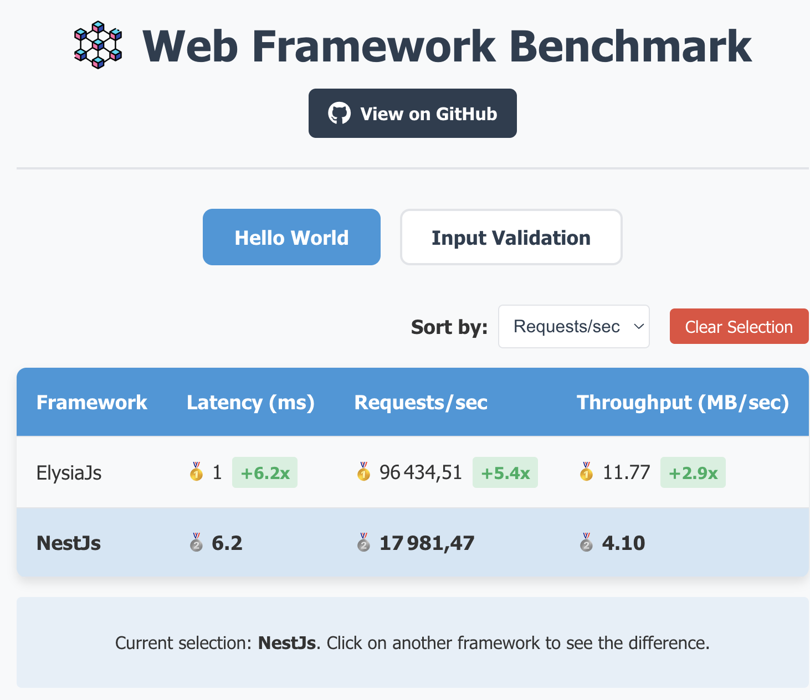

# Web Framework Benchmark

A simple tool to compare performance metrics of different web frameworks.

## 🤖 AI-Generated Webpp

https://backend-benchmark-webapp.vercel.app/

## 📊 What It Does

- Benchmarks web frameworks (ElysiaJS and NestJS)
- Visualizes results (webapp)
- Ranks frameworks by performance metrics (webapp)
- Shows relative performance between frameworks (webapp)

## 🛠️ Frameworks Tested

- **[NestJs](https://nestjs.com/)** - "A progressive Node.js framework for building efficient, reliable and scalable server-side applications."
- **[ElysiaJs](https://elysiajs.com)** - "Ergonomic Framework for Humans
  TypeScript with End-to-End Type Safety, type integrity, and exceptional developer experience. Supercharged by Bun."
- **[Hono](https://hono.dev/)** - "Web application framework Fast, lightweight, built on Web Standards. Support for any JavaScript runtime." (ty @marek-e !)
